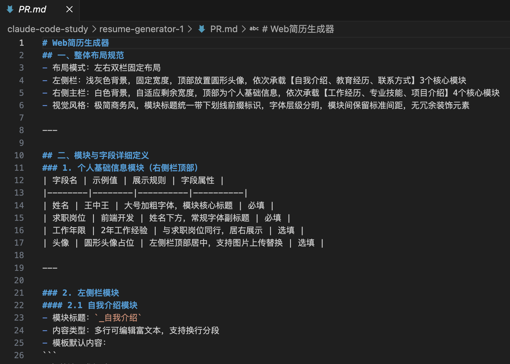
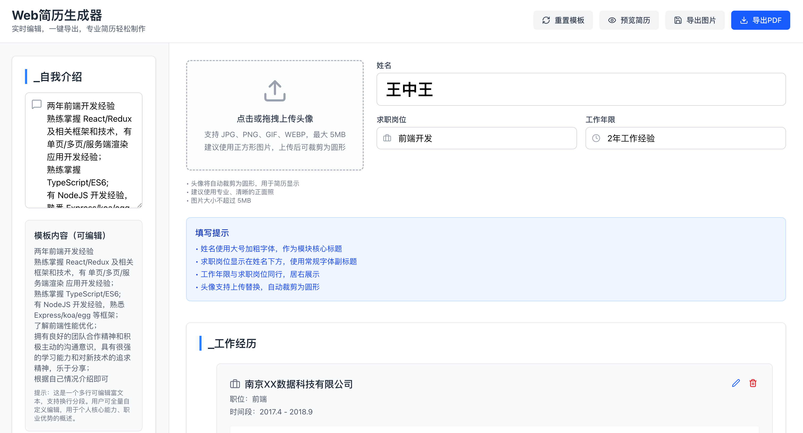
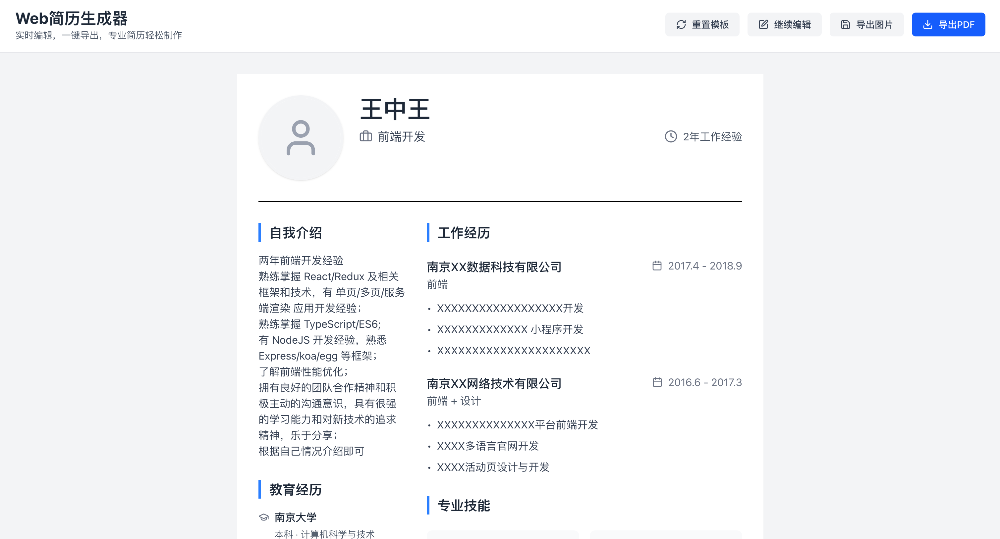
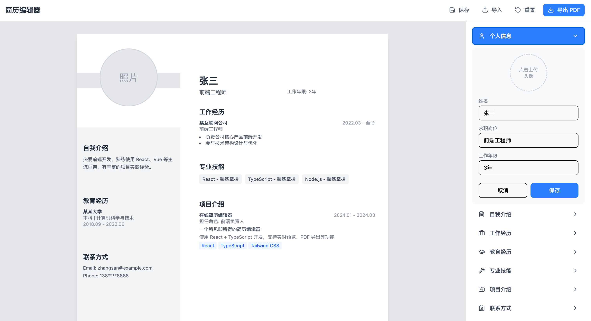
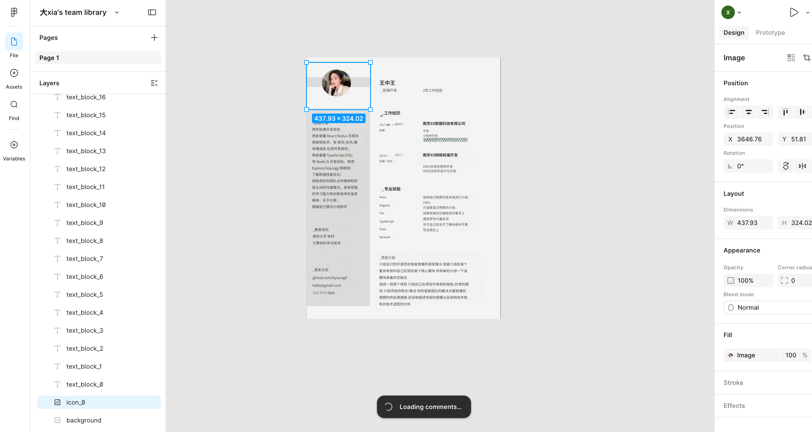
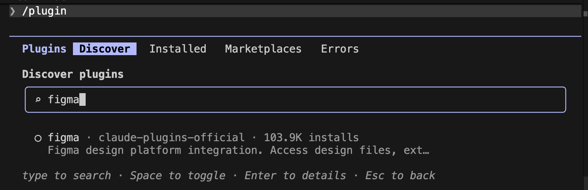
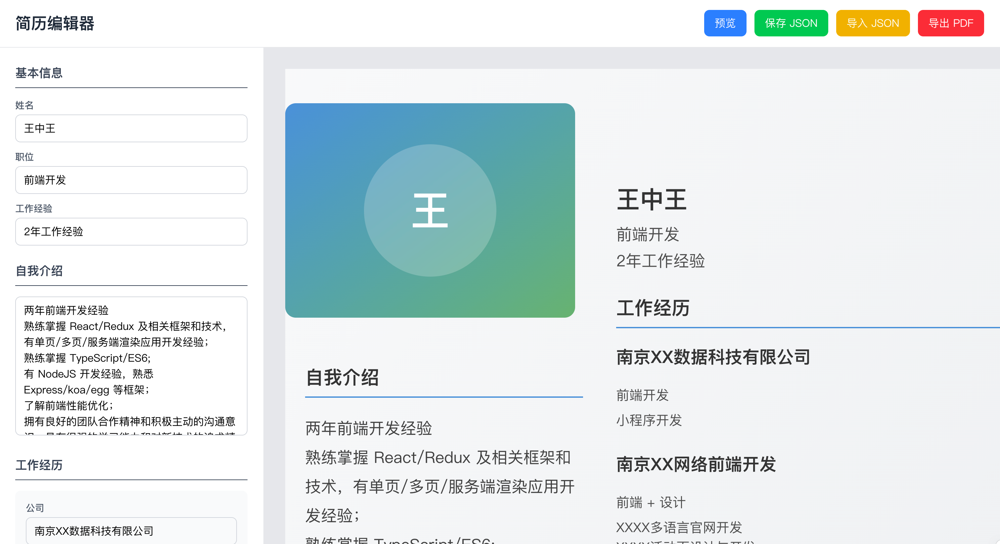

使用 AI 编程工具，将一张图片变为web应用，使用什么样的方案最好呢？

最近因为写简历想找一个简历模板，于是去搜索引擎搜索，找到的都是一些需要登陆的三方网站，或者一些图片，刚好看到一个满意的简历图片，有了图片之后怎么让它成为自己的简历呢？

作为开发人员，在这个 AI 盛行的当下，当然是自己写一个简历编辑器了，也借此探索一下使用AI的最佳实践：

想要的效果如下:


## 一、第一个回合

我把图片下载下来了，新建一个项目，打开 Claude Code，输入如下提示词
```bash
参考 @1776222397194.png 这个图片生成一个web程序，可以自定义简历内容
```

效果如下：


这样式只能说一点也不搭边；

## 二、第二个回合

按照使用 LLM 的最佳实践，效果不满意就重开，不要屎上添花；

清空项目文件夹和对话历史，我先切换到 `plan-mode` 模式，输入提示词：
```bash
参考 @1776222397194.png 这个图片，生成一个web端的简历生成应用
```

先让 AI 通过 `plan-mode` 生成 PRD：


然后输入提示词：
```bash
按照 @PR.md 的要求生成一个web端应用
```

效果如下：

**简历编辑态:**


**简历预览态:**


效果比第一回合对话好了点，但还是不符合要求；

## 三、第三个回合

清空项目和对话历史，继续对话，第一轮对话过后还是不行，后面经过多轮对话调整之后才大概可以满足需求；

提示词：
```
# 第1轮对话
参考 @1776222397194.png  详细说明左边简历展示页的结构，大致是左右结构，左上头像，左边有自我介绍、教育经历、联系方式，右边是姓名、工作经历、专业技能、项目介绍等
# 第2轮对话
左侧背景色为灰色，右侧为纯白，注意 工作经历、专业技能、项目介绍等可以添加多个子项
# 第3轮对话
简历结构不对，应该是整体左右结构，照片放在左边，姓名放在右边
# 第4轮对话
整体左右结构，照片下的分割线放在整体左右之间
# 第5轮对话
分割线在页面中间偏左的位置，左边的是头像、自我介绍、教育经历联系方式，右边是其他的
# 第6轮对话
测试一下，看看布局对不对
# 第7轮对话
灰色背背景上下留一部分的白色
# 第8轮对话
照片下方三分之二的照片宽度改为白色背景，只留横穿照片中部的照片三分之一宽度的灰色背景，上方也改为白色背景
# 第9轮对话
去除照片区域的灰色背景，保留自我介绍以下的灰色背景

......
```

效果如下：



花费接近两个小时，实现了预期的效果，我在想有没有更好的方式？


## 四、第四个回合

使用 figma 处理图片，然后让 claude code 通过 figma mcp 来连接 figma 获取设计稿；

首先，使用 figma 将图片转换为具有元素的布局：


然后在 claude code 通过 `/plugins` 命令直接在官方市场搜索安装 figma 插件：


安装和重新加载插件后登陆 figma，开始对话：
```bash
读取 @prompt.md 的命令，按命令执行任务
```

prompt.md 文件如下：
```markdown
请使用 figma 这个插件读取这个 Figma 设计文件，根据里面的 UI 结构生成完整可直接运行的前端网站代码。
要求：
1. 技术栈：React + Tailwind CSS
2. 像素级还原布局、颜色、间距、圆角、字体
3. 生成语义化标签，结构清晰
4. 可直接在浏览器打开运行
5. 不要省略样式，不要使用占位图
6. 支持编辑
7. 支持pdf导出
8. 支持json格式保存>和导入

Figma 文件链接：<对应的链接>
```


效果如下：



## 总结


在第四个回合中，claude code + figma 将图片转换成web应用：
图片 -(figma图片转layout插件)> 设计稿 -(figma mcp)> 文字 -> LLM -> web应用；

在前三个回合中，claude code + 图片 直接转换成web应用：图片 -> 文字 -> LLM -> web应用；


**总结：**
使用 figma 来参与开发并没有表现更好，通过第一性原理分析：LLM输入的是文字，idea转换成文字的路径越短，理论上效率越高；
在使用 AI 编程工具的过程中，最好：

1. 让 AI 先完善方案，再按照完善后的方案执行

2. 减少 图片 -> 应用 转换过程的路径


**衍生想法**：产品、设计、开发 谁先被AI消灭？在样式主题已经确认的情况下不需要设计？


------

项目仓库：[resume-generator](https://github.com/Dada-liu/resume-generator)

体验简历生成器：[使用resume-generator](https://dada-liu.github.io/resume-generator/)