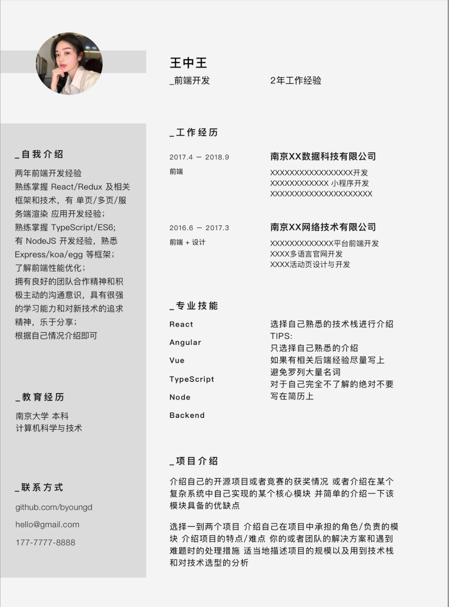
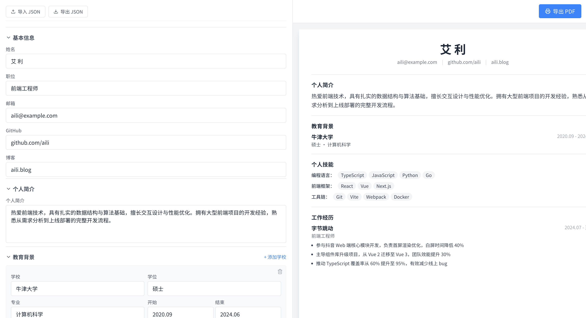

使用 AI 辅助编程工具，将一张截图变为web应用，使用什么样的方案最好呢？

我最近因为写简历，想找一个好的简历模板，于是我去搜索引擎搜，能搜到一些图片，于是我选了一个自己满意的简历图片，有了图片之后怎么让它成为自己的简历呢？

身为技术人，在这个 AI 盛行的当下，当然是自己写一个简历编辑器了；

想要的效果如下:


## 回合一

我把图片下载下来了，新建一个项目，打开 Claude Code，输入如下提示词

```bash
参考 @1776222397194.png 这个图片生成一个web程序，可以自定义简历内容
```

效果如下：




这样式只能说一点也不搭边；

## 回合二

按照使用 LLM 的最佳实践，效果不满意就重开，不要屎上添花；

清空项目文件夹和对话历史，我先使用 `plan-mode` 模式，先让 AI 生成 PRD：


## 1. 从设计到代码的转化

当你只有一张设计图时，AI可以帮助你：

- **分析设计结构**：让AI描述图片的布局、颜色、组件关系
- **生成HTML/CSS**：基于分析结果生成基础代码
- **识别组件**：将设计拆分为可复用的组件

> 关键提示：详细的描述能带来更准确的代码生成结果。

## 2. AI辅助编程的核心技巧

### 编写有效的提示词

```
❌ 不好：帮我写个按钮
✅ 更好：创建一个圆角按钮，背景色#1a1a1a，文字白色，
       hover时背景变#333，transition 0.2s，使用HTML+CSS
```

### 分步骤生成

不要试图让AI一次性生成整个应用，而是：

1. 先生成基础框架
2. 逐个组件实现
3. 最后集成和调试

## 3. 实战案例

### 案例：天气仪表盘

从一个简单的设计图开始：

1. **Prompt 1**：生成基础HTML结构
2. **Prompt 2**：添加CSS样式
3. **Prompt 3**：实现JavaScript逻辑
4. **Prompt 4**：优化性能和动画效果

## 4. 常见陷阱与避坑指南

| 陷阱 | 解决方案 |
|------|----------|
| 生成的代码有安全漏洞 | 始终审查AI生成的代码 |
| 过度依赖AI | AI是辅助，不是替代 |
| 忽略代码可维护性 | 建立代码规范和review流程 |

## 5. 推荐工具栈

- **代码生成**：Claude Code、Copilot
- **UI组件**：Figma AI
- **API设计**：Swagger AI
- **测试生成**：AI Testing Tools

## 结语

AI正在改变我们编写软件的方式。掌握这些工具和方法，将帮助你在现代开发中保持竞争力。关键是要善用AI的能力，同时保持对代码质量和架构的掌控。

---

*如果你有任何问题或想法，欢迎通过博客下方的方式与我交流。*
