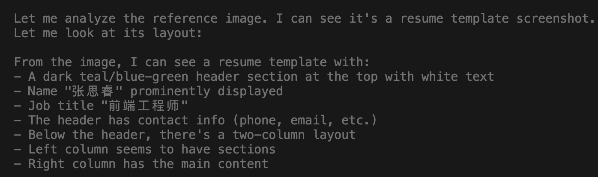

在上篇文章[《一张图 → 完整应用：我用 ClaudeCode 复刻了这个开发流程》](https://dada-liu.github.io/my-github-pages/#blog)中，我用 4 个回合的实践验证了一个核心结论：**LLM 处理的是文字，从 idea 到文字的路径越短，效率越高。**

一个多月过去了，我又在日常开发中积累了不少 Claude Code 的进阶用法。这篇文章不讲入门，只讲那些能真正提效的操作。

1、使用 deepseek v4 + skill v1 的效果如下

简历图片识别就错了：


```markdown


```

deepseek v4 就没有图像识别的能力；

本来想用 claude opus 来做，但是是搞了半天没搞定 api key，放弃

2、使用 doubao + skill v1 的效果如下


比使用网页版豆包生成的UI还更不一致，我这 skill 的提示词肯定有问题，于是更改 skill：

```markdown
---
description: 创建一个新的简历模板
disable-model-invocation: true
---

# 创建一个新的简历模板

## 原则
1. 简历模板中的每一个模块（如个人信息、教育背景、工作经历、技能等）都应该和编辑区域各个的输入框和组件正确绑定，确保用户在编辑区域输入的信息能够正确显示在简历预览中。
2. 对于个人信息模块，确保头像上传功能、显示头像功能正常工作。
3. 在不同设备和屏幕尺寸，简历预览、编辑区域要有相应的响应式设计。

## 工作流程

### 一、设计新模板
1. 获取 $ARGUMENTS 中的内容，如果有图片、文件、设计稿，读取图片、文件、设计稿：
  * 提取完整结构：划分所有模块（头像、个人信息、教育、工作经历等）；
  * 提取所有样式：颜色、字体、布局、间距、边框、背景色；
  * 将提取的内容新建一个md文件存放，命名为 $ARGUMENTS[0]_design.md。

### 二、实现新模板
按$ARGUMENTS[0]_design.md中的设计实现新模板；

新的模板目录结构如下：
```
src/templates/<template-name>/
├── <TemplateName>.tsx         # 简历预览组件
├── resumeConfig.ts            # 简历配置（默认简历数据 + 编辑模块定义）
└── editors/                   # 各模块对应的编辑组件
    ├── PersonalInfoEditor.tsx
    ├── SummaryEditor.tsx
    ├── ...
```

1. 创建模板预览组件，命名为 `$ARGUMENTS[0]`，接受 `{ data: ResumeData }` props。
2. 创建 `resumeConfig.ts`，导出：
   - `<name>DefaultResume: ResumeData` — 该模板的默认简历数据
   - `<name>EditorModules: EditorModule[]` — 编辑模块定义数组，每个模块包含 id、label、icon（lucide-react 组件）、component（编辑器组件）
3. 创建 `editors/` 文件夹，实现每个模块对应的编辑组件，编辑组件直接使用 `useResumeStore` 读写数据。
4. 在 `src/templates/index.ts` 中注册新模板，包含 id、name、component、defaultResume、editorModules。

### 三、验证新模板
调用 chrome-devtools mcp进行调试，确保新模板的布局和功能符合预期。
1. 验证新模板的布局是否正确，确保各个部分（个人信息、教育背景、工作经历、技能等）都正确显示。
2. 验证编辑区域的输入框和组件是否正确绑定到模板中的相应部分，确保编辑组件的操作逻辑正确无误。
3. 验证切换模板时正确应用模板的默认简历数据和编辑模块。
4. 验证新模板的响应式设计，确保在不同设备和屏幕尺寸下都能正确显示和使用。
5. 验证 保存、导入、导出PDF 等功能是否正常工作.

```


还发现一个问题，项目的抽象有问题，每个模板的组成模块并不一样，类似模块的名称不一样，于是更改项目抽象：


2、使用 minimax + skill v1 的效果如下

3、使用 claude + skill v1 的效果如下


**相关资源：**
- 第一弹：[一张图 → 完整应用：我用 ClaudeCode 复刻了这个开发流程](https://dada-liu.github.io/my-github-pages/#blog)
- Claude Code 官方文档：[docs.anthropic.com](https://docs.anthropic.com/en/docs/claude-code)
