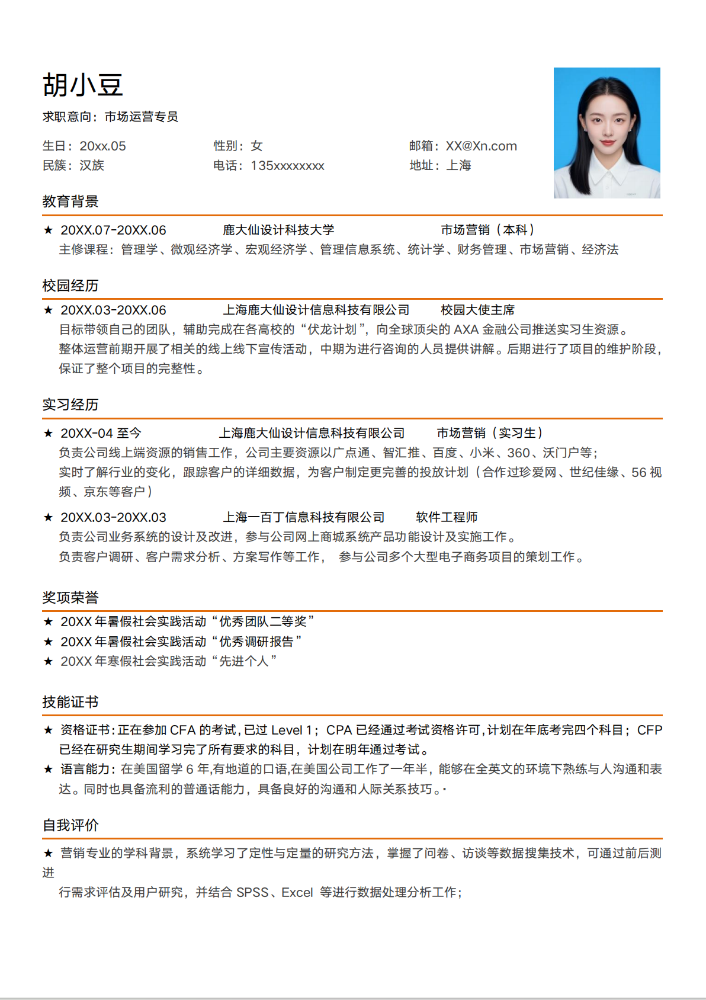
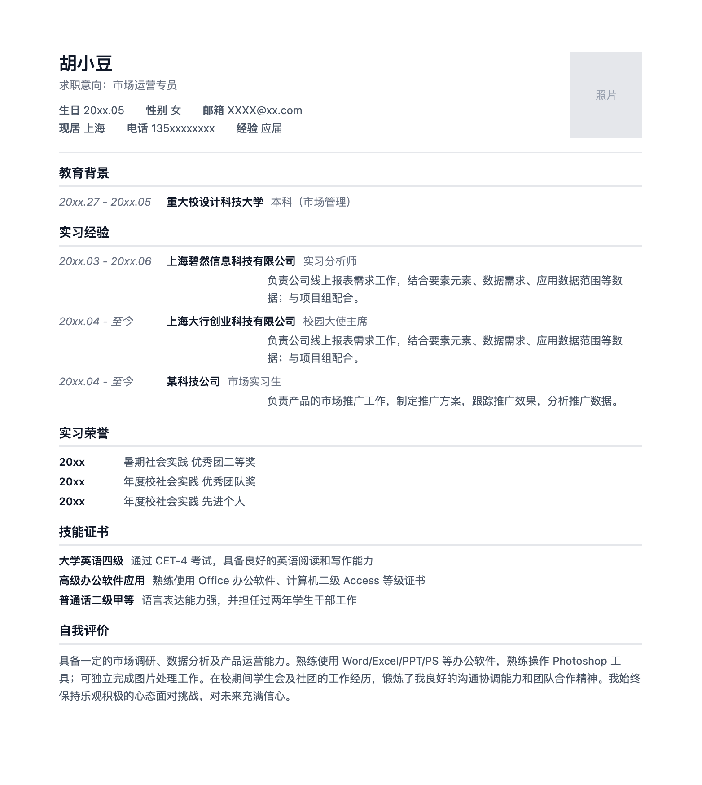
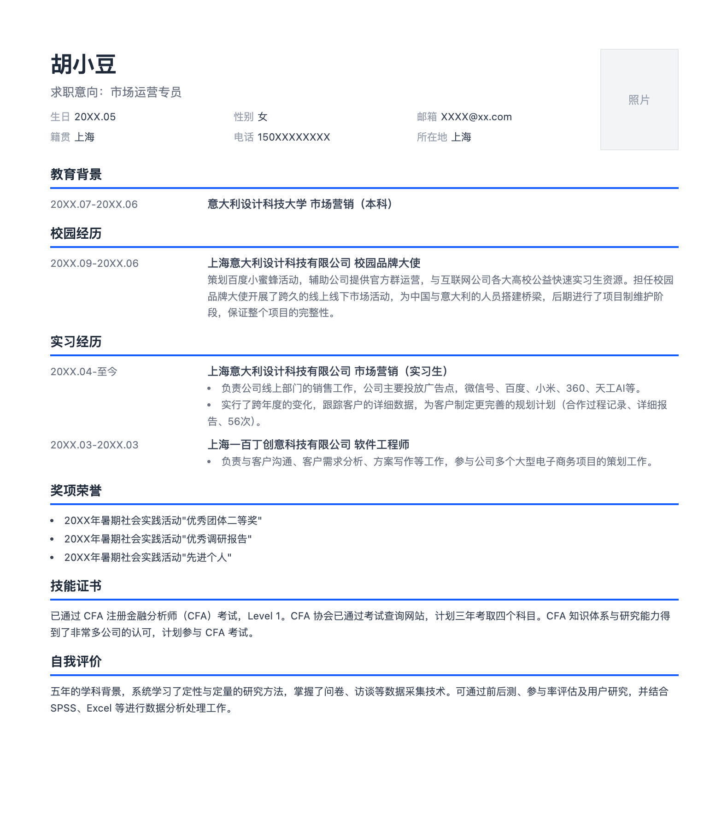
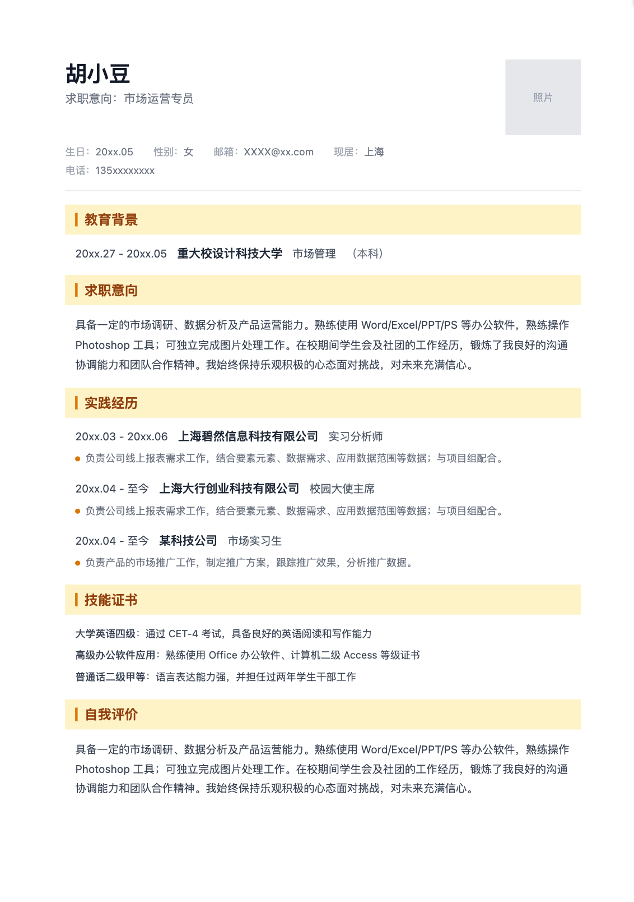
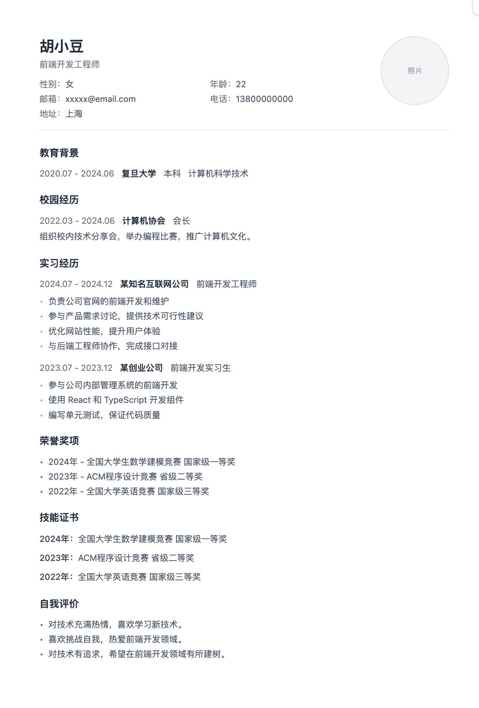

## 一、前言

在上篇文章[《一张图 → 完整应用：我用 ClaudeCode 复刻了这个开发流程》](http://127.0.0.1:5500/my-github-pages/index.html#blog/ai-assisted-development)中，我用 4 个会话回合的实践验证了一个核心结论：**LLM 处理的是文字，从 idea 到文字的路径越短，效率越高。**

这一次，我想实现：拥有多个简历模板，通过任意的简历图片就可以转换为一个简历模板；

因为 deepseek 没有图片识别的能力，deepseek 没有测试；

原计划也使用 claude opus 来测试效果，但是是搞了半天没搞定 api key，放弃；

使用的模型如下：
1. MiniMax-M3
2. kimi-k2.6
3. glm-5v-turbo
4. qwen3.7-plus

测试的环境是 React 项目 + ClaudeCode cli。


## 二、使用 Skills 来实现自动化
Claude Code 提供了 Skills 实现工作流的复用，我写了一个 简历图片→简历编辑器 的 Skill：

```markdown
  ---
  description: 创建一个新的简历模板
  disable-model-invocation: true
  ---

  # 创建一个新的简历模板

  你是一个资深前端开发工程师和资深UI/UX设计师。用户会提供一张简历模板图片（通常包含个人信息、工作经历、教育背景、技能等模块）。你的任务是将这张图片完整、精确地转换为一个一页A4纸的简历模板，并确保样式与视觉布局高度一致。

  ## 原则
  1. 简历预览区是一张A4纸大小的区域。
  2. 简历预览中的每一个模块（如个人信息、教育背景、工作经历、技能等）标题都应该和编辑区中各个模块的标题统一。
  3. 简历预览中的每一个模块的内容应该和编辑区的各个的输入框和组件正确绑定，确保用户在编辑区输入的信息能够正确显示在简历预览中。
  4. 对于个人信息模块，确保头像上传功能、显示头像功能正常工作。
  5. 在不同设备和屏幕尺寸，简历预览、编辑区域要有相应的响应式设计。

  ## 工作流程

  ### 一、设计新模板
  获取 $ARGUMENTS[1] 这张简历图片，提取设计稿中的元素和样式，设计新模板：

  1. 模板整体大小参考经典模板，在一页纸内放下所有内容，提取完整结构：划分所有模块（头像、个人信息、教育、工作经历等）；
  2. 提取所有样式：布局、边框、背景色、间距、字体、颜色；
  3. 将提取的内容新建一个md文件，存放在模板文件夹下，命名为 $ARGUMENTS[0]_design.md，
    各个模块要严格按给定的参考排序，其中每个模块包含：
      * 模块整体描述
      * 模块组成元素描述表格：表格列表项包括 元素名称、元素在模块中的位置、元素样式、[你认为需要的其他项]，表格中的元素要尽可能详细地描述元素在模块中的位置和样式，确保大模型能够根据描述准确还原设计稿中的元素布局和样式。

  参考如下：
    ```# $ARGUMENTS[0] 模板设计稿

      # ${templateName} 设计文档

      ## 整体布局

      | 设计项 | 具体描述 |
      | --- | --- |
      | 页面尺寸 | A4纸大小，纵向布局 |
      | 边距 | 上下左右边距均为 20mm |
      | 背景色 | #FFFFFF |
      | 字体 | 主要字体：PingFang SC，备用字体：Microsoft YaHei |

      ## 模块设计

      ### XXXX模块（模块名要和图片中的模块名一致）

      XXXX模块位于简历的顶部，包含元素1、元素2和元素3等元素。元素1位于左侧，元素2和元素3位于头像的右侧。
      特殊说明：元素1周围有双实现细边框，边框颜色为 #E5E7EB，边框宽度为 2px。

      | 元素名称 | 位置 | 样式 | 响应式处理 |
      | --- | --- | --- | --- |
      | 元素1 | 左侧 | 圆形，直径 100px，边框 2px #E5E7EB | 在移动端隐藏或缩小 |
      | 元素2 | 元素1右侧 | 字体大小 24px，颜色 #111827，粗体 | 在移动端缩小到 20px |
      | 元素3 | 元素2下方 | 字体大小 16px，颜色 #6B7280 | 在移动端缩小到 14px |

    ```


  ### 二、校验设计稿
  调用 chrome-devtools mcp 对比图片、文件、设计稿，再次校验 $ARGUMENTS[0]_design.md 中的元素描述是否完整、准确，确保每个元素在设计稿中的位置和样式都被清晰地描述出来，能够指导后续的模板实现工作。

  中断任务，等待用户确认设计稿无误后再继续进行模板实现。

  ### 三、实现新模板
  按$ARGUMENTS[0]_design.md中的设计实现新模板；

  新的模板目录结构如下：
    ```
    src/templates/<template-name>/
    ├── <TemplateName>.tsx         # 简历预览组件
    ├── resumeConfig.ts            # 简历配置（默认简历数据 + 编辑模块定义）
    └── editors/                   # 各模块对应的编辑组件
        ├── PersonalInfoEditor.tsx
        ├── SummaryEditor.tsx
        ├── ...
    ```

  1. 创建模板预览组件，命名为 `$ARGUMENTS[0]`，接受 `{ data: ResumeData }` props。
  2. 创建 `resumeConfig.ts`，导出：
    - `<name>DefaultResume: ResumeData` — 该模板的默认简历数据
    - `<name>EditorModules: EditorModule[]` — 编辑模块定义数组，模块标题要和图片中的模块名一致，每个模块包含 id、label、icon（lucide-react 组件）、component（编辑器组件）
  3. 创建 `editors/` 文件夹，实现每个模块对应的编辑组件，编辑组件直接使用 `useResumeStore` 读写数据。
  4. 在 `src/templates/index.ts` 中注册新模板，包含 id、name、component、defaultResume、editorModules。

  ### 四、验证新模板
  调用 chrome-devtools mcp 进行调试，确保新模板的布局、样式和功能符合预期。
  1. 验证新模板的布局是否正确，确保各个模块（个人信息、教育背景、工作经历、技能等）都正确且按顺序显示。
  2. 验证整体样式、局部样式正确，确保颜色、字体、间距、边框等样式符合设计稿。
  3. 验证编辑区域的输入框和组件是否正确绑定到模板中的相应部分，确保编辑组件的操作逻辑正确无误。
  4. 验证 保存、导入、导出PDF 等功能是否正常工作。
  5. 验证新模板的响应式设计，确保在不同设备和屏幕尺寸下都能正确显示和使用。

```


## 三、对比国内不同模型的效果

下面将会对比国内主流大模型在“按照简历图片开发简历编辑器”上能力的差异；

原始简历图片如下：
<div style="display: flex; align-items: center; justify-content: center; padding: 20px; gap: 20px;">
  
</div>

统一都是新开一个 worktree ，直接调用对应厂商的 api key 进行开发的；
一共有 8 个指标：
* 6 个指标来展示实现的一致性，每满足一个指标加 1 分；
* 2 个指标来展示费用和时间的消耗；

### 1、使用 MiniMax-M3 的效果如下

1. (➕1)简历的整体结构是否一致：
  整体结构一致，但是模块少一个“校园经历”；
2. 各个模块名是否和原简历一致：
  “实习经验”和“奖项荣誉“错误；
3. 整体样式是否一致：
  整体样式不一致，“个人信息”模块下多了一条分割线，模块名下滑线的颜色不一致；
4. 各模块的内容结构、样式是否一致：
  “个人信息”-地址 变成了 “个人信息”-经验；
  “教育背景”缺少主修课程的内容；
  “实习经历“中的实习内容样式错误，左边留了一大段空白区；
5. (➕1)模块名和编辑器的模块名是否一致：
  一致，但是编辑器的模块没有按简历预览中各模块的顺序展示；
6. (➕1)编辑区修改是否能同步到预览区：
  能同步；
7. 花费金额：
  3.9678 元
8. 花费时间：
  10m1s

<div style="display: flex; align-items: center; justify-content: center; padding: 20px; gap: 20px;">
  
  <div style="width:1px;height:220px;background:#ccc;"></div>
  
</div>

### 2、使用 kimi-k2.6 的效果如下

唯一一个询问我：现有编辑区的模块命名和测试简历的模块命名不一样，是否需要新增数据字段？

<br>

1. (➕1)简历的整体结构是否一致：
  一致；
2. (➕1)各个模块名是否和原简历一致：
  一致；
3. 整体样式是否一致：
  整体基本一致，只有模块名下滑线颜色不一致；
4. (➕1)各模块的内容结构、样式是否一致：
  除了“教育背景”下的主修课程缺失，其他模块都基本一致；
5. (➕1)模块名和编辑器的模块名是否一致：
  完全一致，并且编辑器的模块排列顺序和简历一致；
6. 编辑区修改是否能同步到预览区：
  “个人信息”模块下生日、性别等信息没有对应的字段编辑组件，无法编辑；
  其他模块没问题；
7. 花费金额：
  9.51622元
8. 花费时间：
  5m54s


<div style="display: flex; align-items: center; justify-content: center; padding: 20px; gap: 20px;">
  
  <div style="width:1px;height:220px;background:#ccc;"></div>
  
</div>

### 3、使用 glm-5v-turbo 的效果如下 

首先就是 worktree 的命名（abundant-singing-globe）很怪；

<br>

1. (➕1)简历的整体结构是否一致：
  整体一致，缺失“校园经历“和”奖项荣誉“模块，新增了一个原简历没有的求职意向；
2. 各个模块名是否和原简历一致：
  “实习经历”错误；
3. 整体样式是否一致：
  模块名的橙黄背景和原简历相差太大
4. 各模块的内容结构、样式是否一致：
  “个人信息“模块缺少民族；
  “教育背景”缺少主修课程的内容；
5. 模块名和编辑器的模块名是否一致：
  一致，但是编辑器区的模块多了“联系方式”；并且编辑器区有“奖项荣誉“模块，但是没有在简历预览中体现，要新增数据之后才有；
6. (➕1)编辑区修改是否能同步到预览区：
  和kimi一样，“个人信息”模块下生日、性别等信息没有对应的字段编辑组件，无法编辑；
  但是新开了一个模块“联系方式”用来编辑个人信息下的各项信息；
7. 花费金额：
  3.472元
8. 花费时间：5m20s

<div style="display: flex; align-items: center; justify-content: center; padding: 20px; gap: 20px;">
  
  <div style="width:1px;height:220px;background:#ccc;"></div>
  
</div>

### 4、使用 qwen3.7-plus 效果如下


1. (➕1)简历的整体结构是否一致：
  一致；
2. (➕1)各个模块名是否和原简历一致：
  一致；
3. 整体样式是否一致：
  没有模块名下划线，无序列表前面有原点，原点颜色不一样；
4. 各模块的内容结构、样式是否一致：
  “个人信息“模块中的求职意向四个字没有，缺少民族，默认头像形状错误；
  “教育背景”缺少主修课程的内容；
5. 模块名和编辑器的模块名是否一致：
  编辑区单独增加了一个“联系方式”模块，缺少“技能证书”模块；
6. (➕1)编辑区修改是否能同步到预览区：
  和 glm 一致；
7. 花费金额：
  3.1188元
8. 花费时间：
  10m45s

<div style="display: flex; align-items: center; justify-content: center; padding: 20px; gap: 20px;">
  
  <div style="width:1px;height:220px;background:#ccc;"></div>
  
</div>

## 四、总结

因为测的时候有些模型有限时折扣，所有消费金额都是去掉限时折扣之后计算的价格；

| 模型         | 得分（总分6分） | 金额（元，非折扣价） | 时间   |
| ------------ | ---- | -------------- | ------ |
| MiniMax-M3   | 3    | 3.9678         | 10m1s  |
| kimi-k2.6    | 4    | 9.51622        | 5m54s  |
| glm-5v-turbo | 2    | 3.472          | 5m20s  |
| qwen3.7-plus | 3    | 3.1188         | 10m45s |


从实现效果来说，kimi-k2.6 最强，最能遵循用户要求；

从花费的RMB上来说，除了 kimi-k2.6 的价格高，其他三家的价格都差不多；

花费的时间我认为是次要的，只要效果和钱少，时间再加点也能接受；


**相关资源：**
- 前一个文章：[一张图 → 完整应用：我用 ClaudeCode 复刻了这个开发流程](https://dada-liu.github.io/my-github-pages/#blog)
- Claude Code 官方文档：[docs.anthropic.com](https://docs.anthropic.com/en/docs/claude-code)
- OpenRouter：这里推荐一下中转站 OpenRouter（名气大、注册方便、可以用支付宝/微信充值，充10💲还能享受免费模型）；
