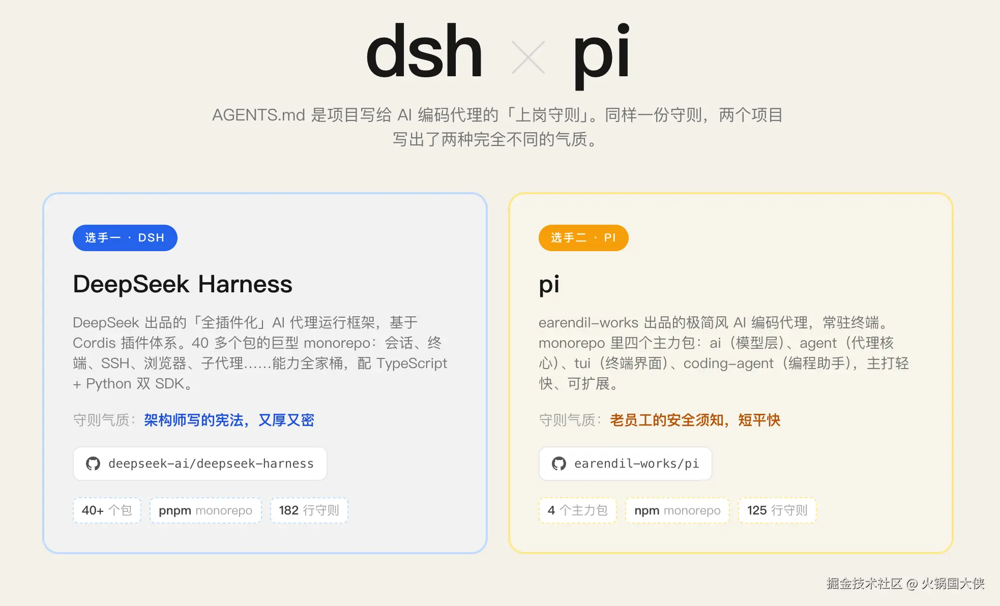
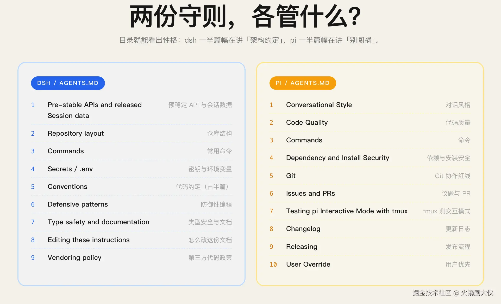
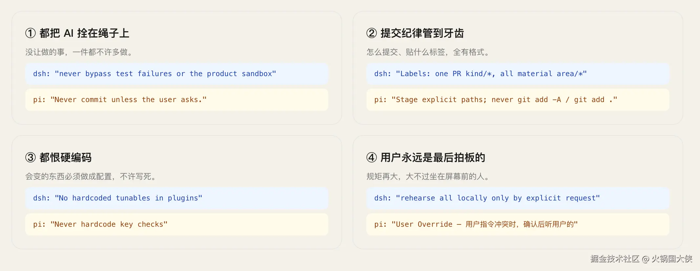

昨天在阮一峰的公众号里看到一个说法：Markdown 正在变成源码；

仔细一想，确实是这样，程序员之前用各种高级语言写的代码也只是二进制的抽象，随着 LLM 发展的突飞猛进，自然语言也就可以了；

最近刚好在看 dsh 和 pi 的源码，我们就从“前沿 Agent 项目的 `AGENTS.md`（规范：code agent 会自动注入到给 LLM 的提示词里）写了什么？”这个角度，看看它们都用自然语言描述了什么;

## Deepseek Harness 和 Pi

先介绍一下两个项目：

两个项目可以说是理念相同，都是希望通过插件去扩展 Agent 的功能；

但是深入细节，它们俩又不一样；

Pi 是只实现了极简内核：代理主循环、系统提示词、四个基础工具、模型适配器，需要更多功能通过 extension 去扩展；

而 dsh 的底层是 cordis，所有东西都是 plugin，连代理主循环也可以替换；

## AGENTS.md

dsh 和 Pi 都是影响力巨大的开源 Agent 项目，一个 246k star，另一个 114k star；

两者项目根目录下的 AGENTS.md 目录如下：

两份文档的链接如下：

1. [github.com/deepseek-ai…](https://github.com/deepseek-ai/deepseek-harness/blob/master/AGENTS.md)
2. [github.com/earendil-wo…](https://github.com/earendil-works/pi/blob/main/AGENTS.md)

通读一下两份文档，

第一印象就是 dsh 的 AGENTS.md 不像是人写的，专有名词有点多，也不知道是不是因为之前看 dsh 的官方文档留下的印象；而 Pi 的的 AGENTS.md 没有这种感觉；

单从文件行数来说，两者都是一百多行，但是 dsh 的文档里引用了大量其他文档，这可能和 hermes agent 一样，项目大，引用的 md 文档也多，并且也有对加载进上下文的文档体量做出限制；

第二印象就是 Pi 的 AGENTS.md 有很多对外部贡献相关的规范，规定了 Issues、PR 和 署名；dsh 为什么没有呢？这是因为 dsh 目前并没有开放 PR；

## 进一步对比

因为 LLM 的底层特性是预测，所以两份 AGENTS.md 都是一致的约束 LLM 不要随意发挥：

也契合了 Agent = LLM + Harness，给 LLM 增加马鞍，控制 LLM 的行进方向；

pi 只有 4 个主力包，AGENTS.md 也写的更简洁；

而 dsh 有 40 多个包，甚至 dsh 还有两个沙箱环境；
所以 dsh 的 AGENTS.md 里有更多限制，甚至项目里有每个功能的决策记录；

还有一个值得关注的是 dsh 从开源到现在才接近 2 个月，版本还没固定，就像 README 里说的：

> DeepSeek Harness 处于 _开发者预览_ 阶段，正在快速迭代。
> **未来将出现破坏兼容性的变更。**

AGENTS.md 里也有，在第一节就是：

> Public APIs are pre-stable; update every consumer. Follow [version/status](https://github.com/deepseek-ai/deepseek-harness/blob/master/docs/session-format-status.md) and [type acknowledgements](https://github.com/deepseek-ai/deepseek-harness/blob/master/docs/cookbook/reviewing-persistence-type-changes.md). [Adjacent migration](https://github.com/deepseek-ai/deepseek-harness/blob/master/.agents/notes/implemented/architecture/2026-08-31-released-session-format-migrations.md) may add a version-named successor but never move, overwrite, or delete committed generations; predecessors imply neither fallback nor downgrade support. SQLite uses monotonic `SCHEMA_VERSION`.
>
> Acknowledge [declared persistence-type changes](https://github.com/deepseek-ai/deepseek-harness/blob/master/docs/cookbook/reviewing-persistence-type-changes.md).
>
> Record each externally perceptible breaking change immediately in an [upgrade guide](https://github.com/deepseek-ai/deepseek-harness/blob/master/.agents/skills/dsh-create-upgrade-guide/SKILL.md).
